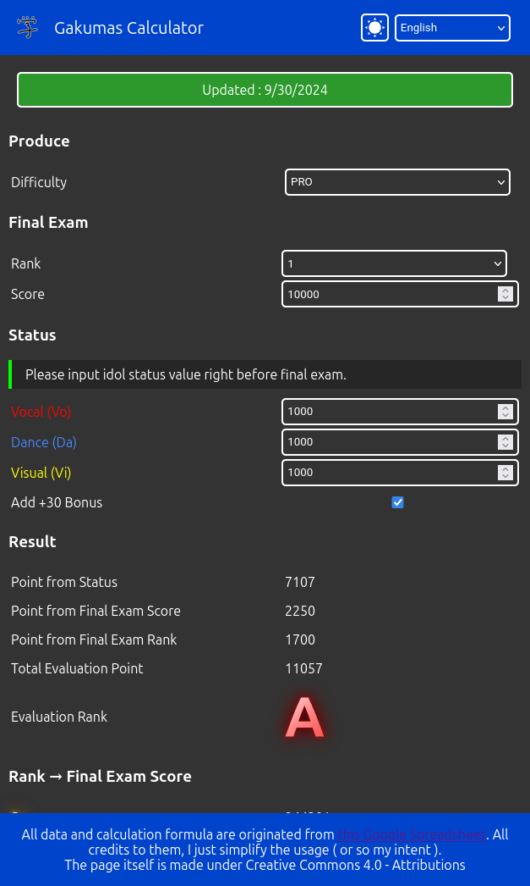
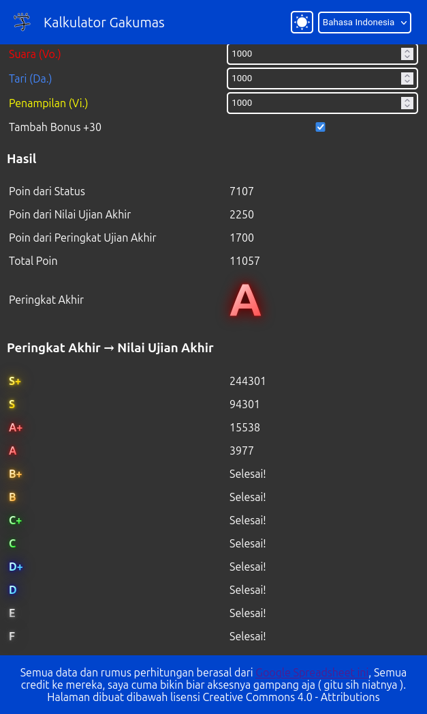
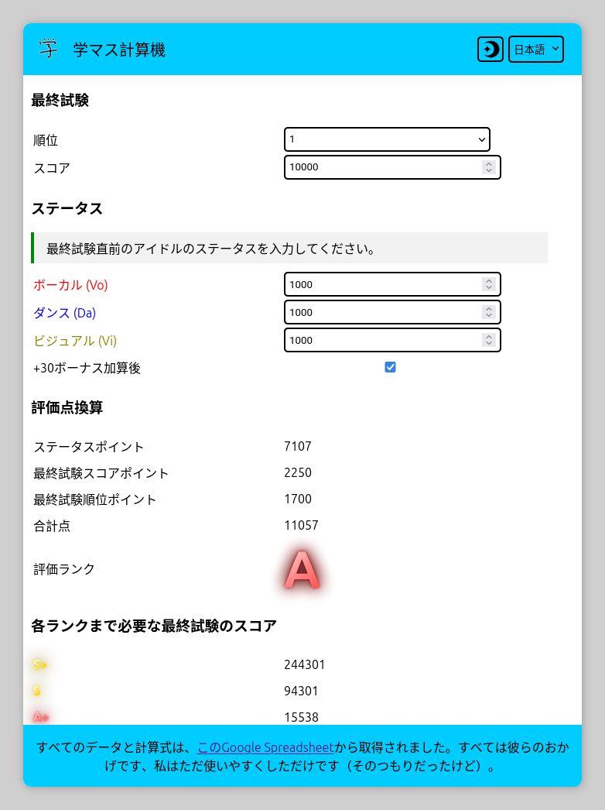

# Gakuen Idolmaster Calculator
<center style="font-size: 25pt">
<a href="https://emiyasyahriel.github.io/gkms_calc/index.html">❖ Visit Project Page ❖</a>
</center>
<center style="font-size: 14pt"> Game Link : 
<a href="https://play.google.com/store/apps/details?id=com.bandainamcoent.idolmaster_gakuen&hl=ja">Play Store</a> |
<a href="https://apps.apple.com/jp/app/%E5%AD%A6%E5%9C%92%E3%82%A2%E3%82%A4%E3%83%89%E3%83%AB%E3%83%9E%E3%82%B9%E3%82%BF%E3%83%BC/id6446659989">App Store</a> | 
<a href="https://gakuen.idolmaster-official.jp">Official Page</a> 
</center>

------
Simple calculator for Gakuen Idolmaster ( 学園アイドルマスター ) produce evaluation score.

Formula dan Data Source : [学マス計算機](https://docs.google.com/spreadsheets/d/1eEdzfHGi7iXpohR-UHr5-W1z7PcYBqQr8OAV7gcvhR8/htmlview)

> Warning : archaic vanilla JavaScript coding-style ahead. up-to-date JS programmers, brace your heads out of out-of-dateness!

## Screenshots




## Features
- Multi-lingual support
- Made completely using vanilla JavaScript
- Day-night Mode 

## Translation
- English
- 日本語 (Japanese)
- Bahasa Indonesia (Indonesian)

If you want to add new language or update/fix an already available translation, you can always make a fork, make a change to the fork and then make a pull request to this main repo.

All translation strings is in the `./lang` directory, and language list is in the `./tl.js`.

## Run Locally
To either run the calculator locally or test your translation:
- Clone the repo to your device
- Install Ruby and Jekyll
- Start your terminal or command prompt in the repo directory
- Then run this command :
```bash
bundle exec jekyll serve
```
- Now you can open `http://localhost:4000` in your browser to access the calculator

## Contributing
Any contribution, as long as it is done in good faith and does not break anything, is accepted.

Maybe you want to fix the page layout, or add Arabic language, or the game adds additional gameplay that requires new formula. it's accepted.

## Similar Projects
- [学マス評価計算機 (by Kantouzin) ](https://kantouzin.github.io/gkmas-rank-calculator/)

## License
The entire page, except the formula and data, are licensed under [Creative Commons 4.0 - Attribution](LICENSE).
